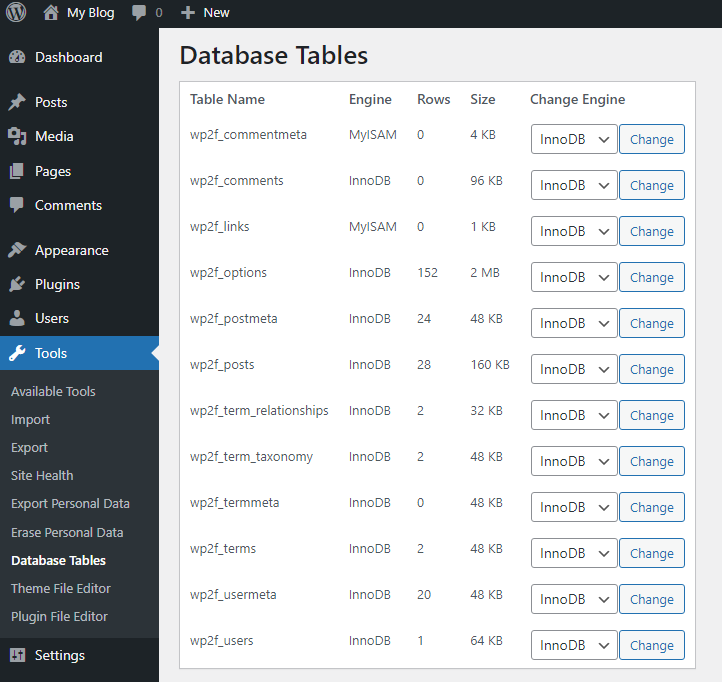

# Database Tables WordPress plugin

!screenshot](assets/Database-Tables-WordPress-Plugin-plugins.club_.png.webp)

Originally, the WordPress database was formatted as type MyISAM but years later they changed the database format to InnoDB. Reportedly, InnoDB is superior to MyISAM in several ways. If your database is not InnoDB, you may benefit from changing it.

This simple plugin will allow you to view all your database tables, their size, and engine.

You can easily change any MySQL database table to InnoDB or MyISAM using this plugin.

Simply activate the plugin and navigate to Tools > Database Tables to view current databases or change their engine to InnoDB or MyISAM.

